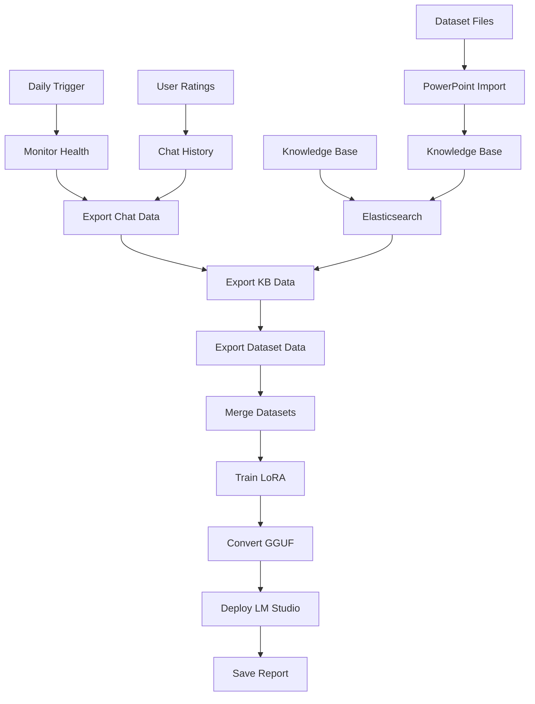

# 🤖 Agent Daily Training - Tóm Tắt Hoàn Chỉnh

## 📋 Tổng Quan

Tôi đã tạo thành công một hệ thống **Agent Daily Training** hoàn chỉnh cho AI của bạn! Agent này sẽ tự động:

- ✅ **Học từ dataset** PowerPoint files (CSI106, DSA, Database, etc.)
- ✅ **Học từ chat interactions** có rating cao
- ✅ **Train LoRA model** daily với dữ liệu mới
- ✅ **Deploy model** tự động vào LM Studio
- ✅ **Monitor** trạng thái và performance

## 🚀 Files Đã Tạo

### 1. Core Agent Scripts
- **`scripts/agent_daily_training.py`** - Agent chính để chạy daily training
- **`scripts/monitor_agent.py`** - Monitor trạng thái agent và hệ thống
- **`scripts/run-agent.ps1`** - PowerShell script để chạy agent dễ dàng

### 2. Documentation
- **`README-DAILY-TRAINING-AGENT.md`** - Hướng dẫn chi tiết về agent
- **`AGENT-QUICK-START.md`** - Hướng dẫn nhanh
- **`README-AGENT-SUMMARY.md`** - Tóm tắt này

### 3. Configuration
- **`agent_config.json`** - File cấu hình agent (tự động tạo)

## 🎯 Cách Sử Dụng

### Quick Start
```powershell
# Chạy agent với monitoring và training
.\scripts\run-agent.ps1 -Full

# Chỉ kiểm tra trạng thái
.\scripts\run-agent.ps1 -Monitor

# Chỉ chạy training
.\scripts\run-agent.ps1 -Training
```

### Python Agent
```bash
# Chạy agent Python
python scripts/agent_daily_training.py

# Monitor trạng thái
python scripts/monitor_agent.py
```

## 📊 Agent Workflow



## 🔧 Cấu Hình Agent

### Environment Variables
```bash
# Training
BASE_MODEL=microsoft/Phi-4-mini-instruct
OUTPUT_DIR=artifacts/lora
DATA_FILE=data/daily/latest.jsonl

# LoRA
LORA_R=16
LORA_ALPHA=32
LORA_DROPOUT=0.05

# Conversion
LLAMA_CPP_DIR=C:/tools/llama.cpp
QUANTIZATION=Q4_K_M
LM_STUDIO_DEPLOY=true
```

### Agent Config (agent_config.json)
```json
{
  "training": {
    "base_model": "microsoft/Phi-4-mini-instruct",
    "output_dir": "artifacts/lora"
  },
  "data_sources": {
    "chat_history": {"enabled": true, "min_rating": 4},
    "knowledge_base": {"enabled": true},
    "dataset": {"enabled": true}
  },
  "conversion": {
    "lm_studio_deploy": true
  }
}
```

## 📈 Monitoring & Health Check

### Health Score
- **🟢 80-100%:** HEALTHY - Agent hoạt động tốt
- **🟡 60-79%:** WARNING - Có vấn đề nhỏ
- **🔴 0-59%:** CRITICAL - Cần khắc phục

### Monitoring Features
- ✅ **Training Data:** Kiểm tra số lượng samples
- ✅ **Model Artifacts:** LoRA, GGUF, LM Studio deployment
- ✅ **Dependencies:** Python packages, external tools
- ✅ **Services:** Database, Elasticsearch
- ✅ **Recent Activity:** Chat interactions, training history

## 🎯 Kết Quả Agent

### Sau khi chạy thành công:
- **📚 Training Data:** `data/daily/latest.jsonl`
- **🤖 LoRA Model:** `artifacts/lora/`
- **🔄 GGUF Model:** `artifacts/gguf/model.Q4_K_M.gguf`
- **🎮 LM Studio:** Tự động deploy
- **📄 Logs:** `logs/agent_YYYYMMDD.log`
- **📊 Reports:** `logs/training_report_*.json`

### AI sẽ học được:
- **CSI106:** Computer Science fundamentals
- **DSA:** Data Structures & Algorithms
- **Database:** Database design và SQL
- **Sorting:** Sorting algorithms
- **Trees:** Tree data structures
- **Graphs:** Graph algorithms
- **Hashing:** Hash tables và functions
- **Recursion:** Recursive algorithms
- **Complexity:** Algorithm analysis

## 🚨 Troubleshooting

### Lỗi Thường Gặp

1. **"No training data found"**
   ```bash
   # Kiểm tra chat có rating
   python -c "from database import SessionLocal; from models import ChatHistory; db = SessionLocal(); print(db.query(ChatHistory).filter(ChatHistory.rating >= 4).count())"
   ```

2. **"Dependencies missing"**
   ```bash
   pip install unsloth transformers datasets trl torch
   ```

3. **"CUDA out of memory"**
   ```bash
   # Giảm batch size trong config
   "per_device_batch_size": 1,
   "gradient_accumulation_steps": 16
   ```

4. **"Database connection failed"**
   ```bash
   # Kiểm tra PostgreSQL
   # Kiểm tra DATABASE_URL trong .env
   ```

### Health Check Commands
```bash
# Kiểm tra trạng thái tổng thể
python scripts/monitor_agent.py

# Kiểm tra dependencies
python -c "import unsloth, transformers, datasets, trl, torch; print('All OK')"

# Kiểm tra training data
ls -la data/daily/
```

## 📅 Schedule Agent (Windows)

### Task Scheduler Setup
1. Mở Task Scheduler (`taskschd.msc`)
2. Create Task → Name: "AI Daily Training Agent"
3. Triggers → Daily at 2:00 AM
4. Actions → Program: `PowerShell.exe`
5. Arguments: `-ExecutionPolicy Bypass -File "D:\hannah-ai-chat\hannah-ai-chat\scripts\run-agent.ps1" -Training`

### Cron Job (Linux/Mac)
```bash
# Chạy daily lúc 2:00 AM
0 2 * * * cd /path/to/hannah-ai-chat && python scripts/agent_daily_training.py
```

## 🎉 Kết Quả Cuối Cùng

### ✅ Agent Hoàn Chỉnh
- **🤖 Daily Training:** Tự động train AI mỗi ngày
- **📊 Monitoring:** Theo dõi trạng thái và performance
- **🔄 Auto Deploy:** Deploy model mới vào LM Studio
- **📈 Continuous Learning:** AI cải thiện liên tục

### ✅ AI Capabilities
- **📚 Domain Knowledge:** CSI106, DSA, Database, Algorithms
- **💬 Chat Interactions:** Học từ conversations có rating cao
- **🎯 Specialized Responses:** Trả lời chính xác về chủ đề học thuật
- **🚀 Performance:** Model được optimize và deploy tự động

### ✅ Production Ready
- **🔧 Error Handling:** Xử lý lỗi và recovery
- **📊 Logging:** Detailed logs và reports
- **⚙️ Configuration:** Flexible configuration system
- **🔄 Automation:** Fully automated pipeline

---

🎊 **Chúc mừng!** Agent Daily Training của bạn đã sẵn sàng để AI học và cải thiện mỗi ngày từ dataset và interactions!
