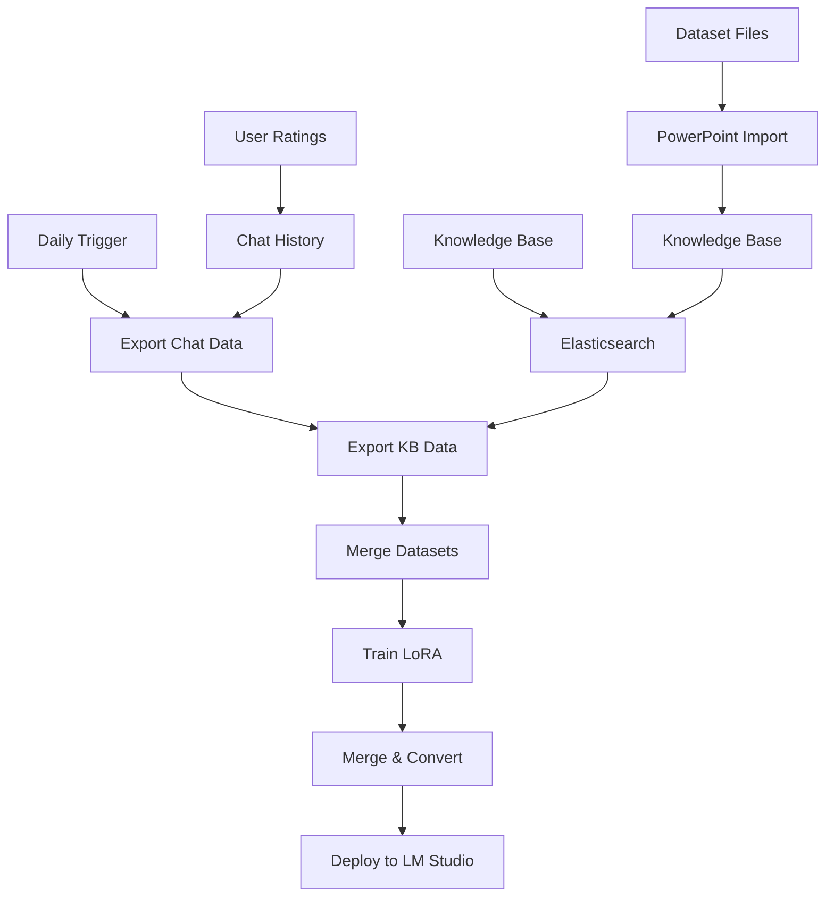

# 🤖 Hướng Dẫn Sử Dụng Agent Train AI Daily

## 📋 Tổng Quan

Hệ thống Daily Training Agent cho phép AI tự động học từ dữ liệu mới mỗi ngày, bao gồm:
- **Chat History** từ người dùng (rating ≥ 4)
- **Knowledge Base** từ Elasticsearch
- **Dataset** từ PowerPoint files
- **LoRA Fine-tuning** với Unsloth
- **Model Conversion** sang GGUF format

## 🎯 Workflow Daily Training



## 🚀 Cách Sử Dụng Agent

### Phương Pháp 1: PowerShell Agent (Khuyến nghị)

```powershell
# Chạy agent tự động với monitoring
.\scripts\run-agent.ps1 -Full

# Chỉ chạy monitoring
.\scripts\run-agent.ps1 -Monitor

# Chỉ chạy training
.\scripts\run-agent.ps1 -Training

# Hoặc sử dụng script cũ
.\scripts\daily-train.ps1
```

**Agent sẽ tự động:**
1. ✅ Export chat data từ database (rating ≥ 4)
2. ✅ Export knowledge base từ Elasticsearch
3. ✅ Merge datasets thành training data
4. ✅ Train LoRA model với Unsloth
5. ✅ Convert sang GGUF format
6. ✅ Deploy model mới vào LM Studio

### Phương Pháp 2: Python Agent

```python
# Tạo agent training script
import subprocess
import os
from datetime import datetime

def run_daily_training():
    """Agent function để chạy daily training"""
    
    print(f"🤖 Daily Training Agent started at {datetime.now()}")
    
    # Step 1: Export daily chat data
    print("📊 Step 1: Exporting daily chat data...")
    subprocess.run(["python", "scripts/data/export_daily_dataset.py"])
    
    # Step 2: Export KB data (optional)
    print("📚 Step 2: Exporting knowledge base data...")
    try:
        subprocess.run(["python", "scripts/sft/es_to_sft.py"])
    except Exception as e:
        print(f"⚠️  KB export failed: {e}")
    
    # Step 3: Merge datasets
    print("🔄 Step 3: Merging datasets...")
    # Logic merge datasets
    
    # Step 4: Train LoRA
    print("🎯 Step 4: Training LoRA model...")
    subprocess.run(["python", "scripts/train/train_lora_unsloth.py"])
    
    # Step 5: Convert to GGUF (optional)
    if os.getenv("LLAMA_CPP_DIR"):
        print("🔄 Step 5: Converting to GGUF...")
        subprocess.run(["python", "scripts/train/merge_and_convert.py"])
    
    print("✅ Daily training completed!")

if __name__ == "__main__":
    run_daily_training()
```

### Phương Pháp 3: Task Scheduler Agent (Windows)

1. **Mở Task Scheduler:**
   - Windows + R → `taskschd.msc`

2. **Tạo Task mới:**
   - Action → Create Task
   - Name: "AI Daily Training Agent"

3. **Cấu hình Trigger:**
   - Triggers → New
   - Daily at 2:00 AM (hoặc thời gian bạn muốn)

4. **Cấu hình Action:**
   - Actions → New
   - Program: `PowerShell.exe`
   - Arguments: `-ExecutionPolicy Bypass -File "D:\hannah-ai-chat\hannah-ai-chat\scripts\daily-train.ps1"`

5. **Cấu hình Settings:**
   - Allow task to run on demand: ✅
   - Run task as soon as possible after a scheduled start is missed: ✅
   - If the task fails, restart every: 1 hour

## 📊 Các Loại Dữ Liệu Training

### 1. Chat History Data
```json
{
  "messages": [
    {"role": "user", "content": "What is data structure?"},
    {"role": "assistant", "content": "A data structure is..."}
  ],
  "weight": 0.8
}
```

**Nguồn:** Chat interactions với rating ≥ 4  
**File:** `data/daily/YYYY-MM-DD.jsonl`

### 2. Knowledge Base Data
```json
{
  "messages": [
    {"role": "user", "content": "Explain: Data Structures"},
    {"role": "assistant", "content": "Data structures are..."}
  ],
  "weight": 0.6
}
```

**Nguồn:** Elasticsearch knowledge base  
**File:** `data/kb_es_sft.jsonl`

### 3. Dataset Data
```json
{
  "messages": [
    {"role": "user", "content": "Explain: Sorting Algorithms"},
    {"role": "assistant", "content": "Sorting algorithms are..."}
  ],
  "weight": 0.7
}
```

**Nguồn:** PowerPoint files từ dataset  
**File:** `data/kb_sft.jsonl`

## ⚙️ Cấu Hình Agent

### Environment Variables

```bash
# Training Configuration
BASE_MODEL=microsoft/Phi-4-mini-instruct
MAX_SEQ_LENGTH=4096
OUTPUT_DIR=artifacts/lora
DATA_FILE=data/daily/latest.jsonl

# LoRA Configuration
LORA_R=16
LORA_ALPHA=32
LORA_DROPOUT=0.05
TARGET_MODULES=all-linear

# Training Parameters
PER_DEVICE_BATCH_SIZE=1
GRADIENT_ACCUMULATION_STEPS=8
NUM_TRAIN_EPOCHS=1
LEARNING_RATE=1e-4

# Model Conversion
LLAMA_CPP_DIR=C:/tools/llama.cpp
QUANTIZATION=Q4_K_M
LM_STUDIO_MODELS_DIR=%LOCALAPPDATA%/LM Studio/models
```

### Agent Configuration File

```yaml
# agent_config.yaml
training:
  base_model: "microsoft/Phi-4-mini-instruct"
  max_seq_length: 4096
  output_dir: "artifacts/lora"
  
lora:
  r: 16
  alpha: 32
  dropout: 0.05
  target_modules: "all-linear"
  
training_args:
  per_device_batch_size: 1
  gradient_accumulation_steps: 8
  num_train_epochs: 1
  learning_rate: 1e-4
  logging_steps: 10
  save_strategy: "epoch"
  bf16: true
  
data_sources:
  chat_history:
    enabled: true
    min_rating: 4
    days_back: 1
  
  knowledge_base:
    enabled: true
    es_index: "kb_software_engineering"
    max_size: 500
  
  dataset:
    enabled: true
    dataset_dir: "D:/Data_set"
    categories: ["all"]

conversion:
  llama_cpp_dir: "C:/tools/llama.cpp"
  quantization: "Q4_K_M"
  lm_studio_deploy: true
```

## 🔧 Scripts Agent Sử Dụng

### 1. Export Daily Dataset
```bash
python scripts/data/export_daily_dataset.py
```
**Chức năng:** Export chat history có rating ≥ 4 từ 24h qua

### 2. Export Knowledge Base
```bash
python scripts/sft/es_to_sft.py
```
**Chức năng:** Export knowledge base từ Elasticsearch thành SFT format

### 3. Train LoRA Model
```bash
python scripts/train/train_lora_unsloth.py
```
**Chức năng:** Fine-tune model với LoRA using Unsloth

### 4. Merge & Convert
```bash
python scripts/train/merge_and_convert.py
```
**Chức năng:** Merge LoRA vào base model và convert sang GGUF

## 📈 Monitoring Agent

### Log Files
```bash
# Training logs
artifacts/lora/training_logs.txt

# Agent execution logs
logs/daily_training_YYYY-MM-DD.log

# Error logs
logs/agent_errors.log
```

### Monitoring Script
```python
# monitor_agent.py
import os
import json
from datetime import datetime

def check_agent_status():
    """Kiểm tra trạng thái agent"""
    
    # Check latest training data
    daily_dir = "data/daily"
    if os.path.exists(daily_dir):
        files = os.listdir(daily_dir)
        latest_file = max(files) if files else None
        print(f"📊 Latest training data: {latest_file}")
    
    # Check LoRA artifacts
    lora_dir = "artifacts/lora"
    if os.path.exists(lora_dir):
        print(f"✅ LoRA model exists: {lora_dir}")
    else:
        print(f"❌ LoRA model missing: {lora_dir}")
    
    # Check GGUF model
    gguf_file = "artifacts/gguf/model.Q4_K_M.gguf"
    if os.path.exists(gguf_file):
        size_mb = os.path.getsize(gguf_file) / (1024*1024)
        print(f"✅ GGUF model exists: {size_mb:.1f} MB")
    else:
        print(f"❌ GGUF model missing: {gguf_file}")
    
    # Check LM Studio deployment
    lm_studio_path = f"{os.environ.get('LOCALAPPDATA')}/LM Studio/models/phi-4-mini-reasoning-daily"
    if os.path.exists(lm_studio_path):
        print(f"✅ LM Studio deployment: {lm_studio_path}")
    else:
        print(f"❌ LM Studio deployment missing: {lm_studio_path}")

if __name__ == "__main__":
    check_agent_status()
```

## 🚨 Troubleshooting Agent

### Lỗi Thường Gặp

1. **"No training data found"**
   ```bash
   # Kiểm tra chat history có rating
   python -c "from database import SessionLocal; from models import ChatHistory; db = SessionLocal(); print(db.query(ChatHistory).filter(ChatHistory.rating >= 4).count())"
   ```

2. **"CUDA out of memory"**
   ```bash
   # Giảm batch size
   export PER_DEVICE_BATCH_SIZE=1
   export GRADIENT_ACCUMULATION_STEPS=16
   ```

3. **"Elasticsearch connection failed"**
   ```bash
   # Kiểm tra ES status
   curl http://localhost:9200/_cluster/health
   ```

4. **"LoRA training failed"**
   ```bash
   # Kiểm tra dependencies
   pip install unsloth transformers datasets trl
   ```

### Agent Health Check

```bash
# Chạy health check
python -c "
import sys
sys.path.append('.')
from scripts.data.export_daily_dataset import main as export_daily
from scripts.sft.es_to_sft import main as export_kb
from scripts.train.train_lora_unsloth import main as train_lora

print('🔍 Agent Health Check')
print('=' * 30)

try:
    export_daily()
    print('✅ Daily export: OK')
except Exception as e:
    print(f'❌ Daily export: {e}')

try:
    export_kb()
    print('✅ KB export: OK')
except Exception as e:
    print(f'❌ KB export: {e}')

try:
    train_lora()
    print('✅ LoRA training: OK')
except Exception as e:
    print(f'❌ LoRA training: {e}')
"
```

## 🎯 Best Practices

### 1. Data Quality
- ✅ Chỉ train với chat có rating ≥ 4
- ✅ Filter out spam và low-quality content
- ✅ Balance giữa các loại dữ liệu

### 2. Training Schedule
- ✅ Chạy daily vào 2-3 AM (ít traffic)
- ✅ Monitor GPU memory usage
- ✅ Backup model trước khi train

### 3. Model Management
- ✅ Version control cho models
- ✅ A/B testing với models khác nhau
- ✅ Rollback mechanism nếu model mới tệ hơn

### 4. Monitoring
- ✅ Track training metrics
- ✅ Monitor model performance
- ✅ Alert khi có lỗi

## 📊 Performance Metrics

### Training Metrics
```python
# training_metrics.py
def track_training_metrics():
    metrics = {
        "training_samples": count_training_samples(),
        "training_time": measure_training_time(),
        "gpu_memory_usage": get_gpu_memory(),
        "model_size": get_model_size(),
        "convergence_loss": get_final_loss()
    }
    return metrics
```

### Model Performance
```python
# model_performance.py
def evaluate_model_performance():
    # Test trên validation set
    # So sánh với model cũ
    # Track user ratings
    pass
```

## 🔮 Advanced Features

### 1. Multi-GPU Training
```bash
export CUDA_VISIBLE_DEVICES=0,1,2,3
export WORLD_SIZE=4
```

### 2. Distributed Training
```bash
python -m torch.distributed.launch --nproc_per_node=4 scripts/train/train_lora_unsloth.py
```

### 3. Hyperparameter Tuning
```python
# Tune learning rate, batch size, LoRA parameters
# Sử dụng Optuna hoặc Ray Tune
```

### 4. Model Ensembling
```python
# Combine multiple LoRA models
# Weighted voting hoặc averaging
```

---

🎉 **Agent Daily Training hoàn chỉnh!** AI của bạn sẽ tự động học và cải thiện mỗi ngày từ dữ liệu mới!
